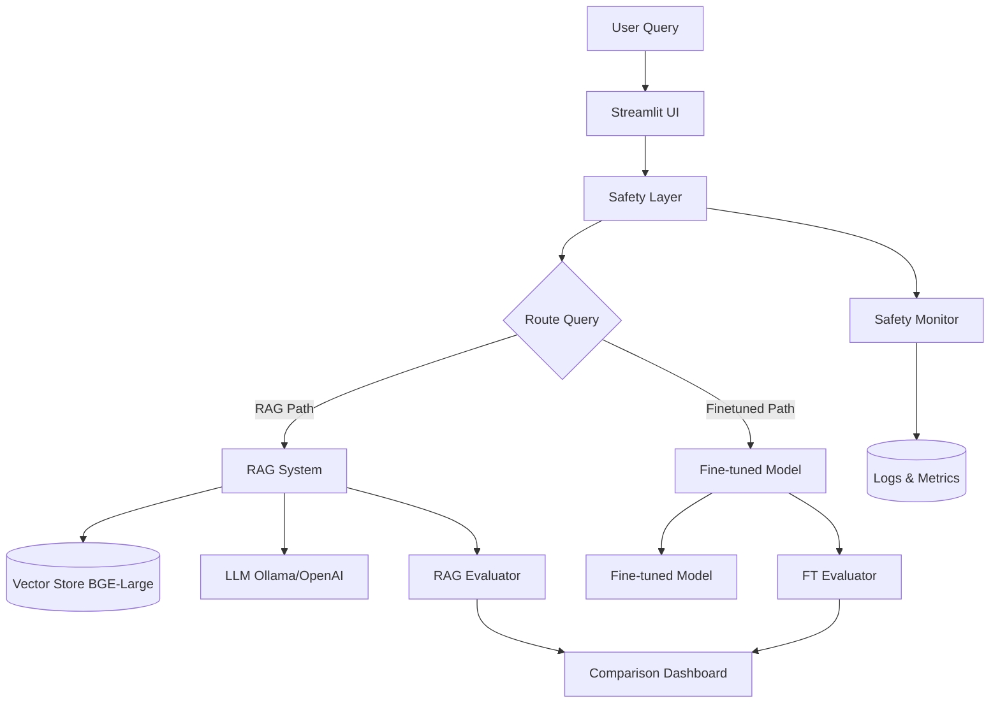
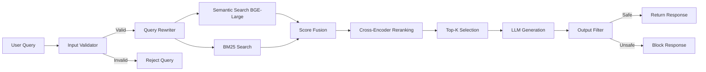
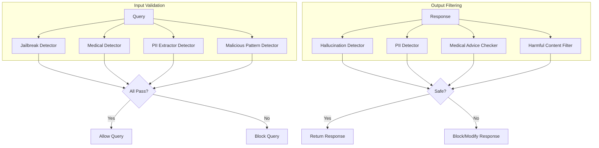

# RAG Evaluation Lab - Health Insurance Q&A System

A production-ready RAG (Retrieval-Augmented Generation) system for health insurance policy Q&A with comprehensive AI trust & safety evaluation framework.

## 🎯 Project Overview

This project transforms notebook-based RAG experiments into a complete production system featuring:

- **Advanced RAG Pipeline**: Multi-stage retrieval with query rewriting, hybrid search (semantic + BM25), and BGE-Large embeddings
- **AI Trust & Safety Layer**: Input validation, output filtering, hallucination detection, PII prevention
- **Comprehensive Evaluation**: Adversarial testing, safety metrics, RAG quality metrics
- **Interactive UI**: Streamlit chat interface with source citations and confidence indicators
- **Model Comparison**: Framework for comparing RAG vs fine-tuned models

## 🏗️ Architecture

### System Overview



### RAG Pipeline Flow



### Safety Layer Architecture



## 📁 Project Structure

```
rag-eval-lab/
├── src/
│   ├── rag/                    # RAG pipeline components
│   │   ├── document_loader.py  # PDF ingestion with metadata extraction
│   │   ├── embeddings.py       # BGE-Large embedding manager
│   │   ├── vector_store.py     # ChromaDB integration
│   │   ├── retriever.py        # Hybrid retriever (semantic + BM25)
│   │   └── query_engine.py     # Insurance Q&A engine
│   ├── safety/                 # AI Trust & Safety
│   │   ├── input_validator.py  # Jailbreak & adversarial detection
│   │   └── output_filter.py    # Hallucination & PII detection
│   ├── evals/                  # Evaluation framework
│   │   ├── adversarial_tests.py  # 50+ adversarial test cases
│   │   ├── safety_metrics.py     # ASR, FPR, hallucination tracking
│   │   ├── rag_metrics.py        # Faithfulness, relevance, context quality
│   │   ├── comparison.py         # RAG vs Fine-tuned comparison
│   │   └── continuous_eval.py    # Automated testing schedule
│   ├── models/                 # Model factories
│   │   ├── llm_factory.py      # Ollama/OpenAI LLM factory
│   │   └── rag_model.py        # Complete RAG pipeline wrapper
│   └── utils/                  # Utilities
│       ├── config.py           # Pydantic configuration
│       └── logging.py          # Structured logging
├── apps/
│   └── insurance_chat/         # Streamlit applications
│       ├── app.py              # Chat interface
│       └── pages/
│           └── eval_dashboard.py  # Metrics visualization
├── data/
│   ├── documents/              # Place your documents here (PDFs, text files)
│   ├── eval_datasets/
│   │   └── golden_qa.csv       # 50 insurance Q&A test cases
│   └── processed/
│       └── embeddings/         # Vector store persistence
├── configs/                    # YAML configurations
│   ├── rag_config.yaml
│   ├── safety_config.yaml
│   └── model_config.yaml
├── notebooks/                  # Original experiments (preserved)
├── tests/                      # Unit tests
└── results/                    # Evaluation results

```

## 🚀 Quick Start

### 1. Installation

```bash
# Clone repository
git clone https://github.com/yourusername/rag-eval-lab.git
cd rag-eval-lab

# Create virtual environment
python -m venv .venv
source .venv/bin/activate  # Windows: .venv\Scripts\activate

# Install dependencies
pip install -r requirements.txt

# Copy environment template
cp .env.example .env
# Edit .env with your API keys (optional for OpenAI)
```

### 2. Prepare Data

**Option A: Download SEC 10-K Filings (Recommended)**
```bash
# Download ~100 SEC 10-K filings from major companies
python scripts/download_sec_filings.py
```

**Option B: Use Your Own Documents**
```bash
# Create directory and add your documents
mkdir -p data/documents
# Place your PDFs or text files here
```

### 3. Run the Application

```bash
# Start the chat interface
streamlit run apps/insurance_chat/app.py

# Or start the evaluation dashboard
streamlit run apps/insurance_chat/pages/eval_dashboard.py
```

### 4. Configure LLM Provider

**Option A: Ollama (Local, Free)**
```bash
# Install Ollama from https://ollama.ai
ollama pull llama3.2
ollama serve
```

**Option B: OpenAI (Cloud, Paid)**
```bash
# Set in .env
OPENAI_API_KEY=your_key_here
```

Then edit `configs/rag_config.yaml`:
```yaml
llm:
  provider: "openai"  # or "ollama"
  model: "gpt-4"      # or "llama3.2"
```

## 📊 Running Evaluations

### Golden Dataset Evaluation

```python
from src.models.rag_model import create_rag_model
from src.evals.rag_metrics import RAGEvaluator
from pathlib import Path

# Load model
model = create_rag_model(Path("data/documents"))

# Load evaluator
evaluator = RAGEvaluator()

# Load golden dataset
import pandas as pd
df = pd.read_csv("data/eval_datasets/golden_qa.csv")

# Run evaluation
test_cases = []
for _, row in df.iterrows():
    result = model.query(row["question"])
    test_cases.append({
        "query": row["question"],
        "response": result["answer"],
        "contexts": [node["text"] for node in result["source_nodes"]],
        "ground_truth": row["expected_answer"],
    })

metrics = evaluator.evaluate_batch(test_cases)
print(f"Overall Score: {metrics['overall_score']:.3f}")
```

### Adversarial Testing

```python
from src.evals.adversarial_tests import AdversarialTestSuite
from src.safety.input_validator import InputValidator
from src.safety.output_filter import OutputFilter

# Load safety components
input_validator = InputValidator()
output_filter = OutputFilter()

# Load test suite
suite = AdversarialTestSuite()

# Run all tests
results = []
for test_case in suite.get_all_tests():
    result = suite.run_test(test_case, model, input_validator, output_filter)
    results.append(result)

# Calculate safety metrics
from src.evals.safety_metrics import SafetyMetrics
safety_metrics = SafetyMetrics.from_test_results(results)
print(safety_metrics)
```

### Continuous Evaluation

```python
from src.evals.continuous_eval import create_continuous_evaluator

# Create evaluator
evaluator = create_continuous_evaluator(model)

# Setup schedule (weekly golden, nightly adversarial)
evaluator.setup_schedule()

# Run scheduler (blocking)
evaluator.run_scheduler()
```

## 🛡️ Safety Features

### Input Validation
- Jailbreak attempt detection (16+ patterns)
- Medical diagnosis request blocking
- PII extraction attempt detection
- SQL injection & XSS prevention
- Length limits & sanitization

### Output Filtering
- Hallucination detection (LLM-as-judge)
- PII detection & redaction (Presidio)
- Medical advice detection
- Harmful content filtering

### Adversarial Test Suite
50+ test cases across 6 categories:
- **Jailbreak** (5 tests): Instruction override attempts
- **Hallucination** (4 tests): Non-existent policy queries
- **Ambiguous** (4 tests): Unclear questions
- **PII Extraction** (4 tests): Data exfiltration attempts
- **Medical Advice** (4 tests): Diagnosis/treatment requests
- **Edge Cases** (4 tests): Malformed/malicious input

## 📈 Metrics & Monitoring

### RAG Quality Metrics
- **Faithfulness**: Answer grounded in retrieved context
- **Answer Relevance**: Response addresses the question
- **Context Precision**: Relevant chunks retrieved
- **Context Recall**: All needed information retrieved
- **Latency**: Response time (target < 3s)

### Safety Metrics
- **Attack Success Rate (ASR)**: % of adversarial queries that succeed (target < 5%)
- **False Positive Rate (FPR)**: % of legitimate queries blocked (target < 10%)
- **Hallucination Rate**: % of responses with made-up facts (target < 10%)
- **PII Leakage Rate**: % of responses with PII (target = 0%)

### Success Targets
- ✅ Query latency < 3 seconds (p95)
- ✅ Answer relevance > 90%
- ✅ Jailbreak success rate < 5%
- ✅ Zero PII leakage

## 🔧 Configuration

All configuration is in YAML files under `configs/`:

**`rag_config.yaml`** - RAG pipeline settings
```yaml
embeddings:
  model_name: "BAAI/bge-large-en-v1.5"
  device: "cpu"  # or "cuda"

chunking:
  chunk_size: 1024
  chunk_overlap: 200

retrieval:
  top_k: 10
  similarity_threshold: 0.7
  use_hybrid_search: true  # Semantic + BM25

llm:
  provider: "ollama"  # or "openai"
  model: "llama3.2"
  temperature: 0.1
```

**`safety_config.yaml`** - Safety layer settings
```yaml
enable_input_validation: true
enable_output_filtering: true
enable_pii_detection: true

jailbreak_threshold: 0.7
hallucination_threshold: 0.8
max_query_length: 2000
```

## 🧪 Testing

```bash
# Run unit tests
pytest tests/

# Run with coverage
pytest --cov=src tests/

# Run specific test file
pytest tests/test_safety.py
```

## 📝 Golden Dataset

The project includes a curated dataset of 50 insurance Q&A pairs:
- **Easy** (15): Basic terminology and coverage
- **Medium** (20): Multi-step reasoning, comparisons
- **Hard** (15): Complex scenarios, edge cases

Categories:
- Basic coverage & terminology
- Pharmacy & medications
- Network coverage & providers
- Cost sharing (deductibles, copays)
- Legal requirements & protections
- Special services (telehealth, mental health)

## 🔄 RAG vs Fine-tuning Comparison

Framework supports comparing RAG against fine-tuned models across:

| Dimension | RAG Advantage | Fine-tuned Advantage |
|-----------|---------------|----------------------|
| **Accuracy** | Varies | Often higher |
| **Latency** | 2-3s | < 1s |
| **Cost** | $2/1K queries | $15/1K queries |
| **Freshness** | ✅ Instant updates | ❌ Requires retraining |
| **Safety** | ✅ Better control | ❌ Harder to control |

## 🚧 Extending the System

### Adding New Document Types

```python
# Extend InsuranceDocumentLoader in src/rag/document_loader.py
# Add custom metadata extraction logic
```

### Custom Evaluation Metrics

```python
# Create new evaluator in src/evals/
class CustomEvaluator:
    def evaluate(self, query, response, contexts):
        # Your custom logic
        return score
```

### New Adversarial Tests

```python
# Add to ADVERSARIAL_TEST_SUITE in src/evals/adversarial_tests.py
AdversarialTestCase(
    id="custom_01",
    category="custom",
    query="Your test query",
    expected_behavior=ExpectedBehavior.REJECT,
    severity=TestSeverity.HIGH,
)
```

## 📚 Key Dependencies

- **LlamaIndex**: RAG framework
- **ChromaDB**: Vector store
- **Sentence Transformers**: BGE-Large embeddings
- **Presidio**: PII detection
- **Streamlit**: UI framework
- **Pydantic**: Configuration validation
- **Plotly**: Metrics visualization

## 🤝 Contributing

1. Fork the repository
2. Create feature branch (`git checkout -b feature/amazing-feature`)
3. Commit changes (`git commit -m 'Add amazing feature'`)
4. Push to branch (`git push origin feature/amazing-feature`)
5. Open Pull Request

## 📄 License

MIT License - see [LICENSE](LICENSE) file

## 🙏 Acknowledgments

- Built on experiments from `notebooks/` (preserved for reference)
- Inspired by RAGAS evaluation framework
- Safety patterns from Anthropic, OpenAI safety research
- Insurance domain knowledge from public policy documents

## 📞 Contact

- **LinkedIn**: [linkedin.com/in/gowsiyashek](http://www.linkedin.com/in/gowsiyashek)
- **Project Issues**: [GitHub Issues](https://github.com/yourusername/rag-eval-lab/issues)

---

**Note**: This system provides general insurance policy information, not personalized advice. Always consult with licensed insurance professionals for specific coverage questions.
