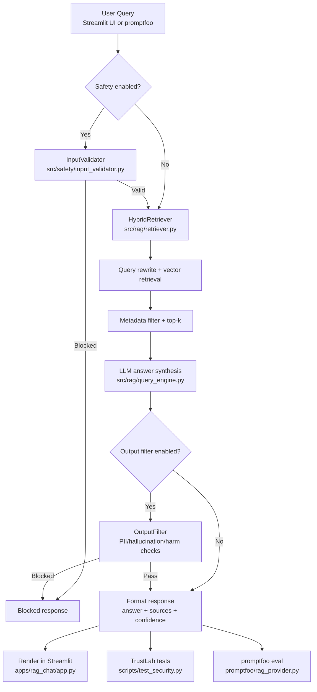

# AI Trust Lab

A modular, dataset-agnostic lab for stress-testing RAG systems and demonstrating AI safety concepts: hallucinations, retrieval failures, context poisoning, and red teaming.

Current dataset: SEC 10-K annual filings (AMZN, CAT, CSCO, CVS, GE, GOOGL, IBM, TJX, UPS, VZ, WMT)

## What this project does

- RAG pipeline: load documents (PDF/TXT), embed, index (Chroma), hybrid retrieval, query engine.
- Fast UI: index is built once via script; Streamlit loads only the pre-built index.
- AI Trust Lab (`src/trustlab`): one module per security concept:
  - Retrieval Trust Boundaries
  - Indirect Prompt Injection
  - Context Poisoning
  - Permission Mistakes
  - Hallucination trigger
  - Red team probes

## Project structure

```text
trust-bound-ai/
|-- src/
|   |-- rag/                     # RAG pipeline
|   |-- trustlab/                # Trust lab modules
|   |-- safety/                  # Input/output safety modules
|   |-- models/                  # RAG model orchestration
|   `-- utils/                   # Config, logging
|-- apps/
|   `-- rag_chat/                # Streamlit chat UI
|-- scripts/
|   |-- build_index.py
|   |-- build_adversarial_corpus.py
|   `-- test_security.py
|-- promptfoo/
|   |-- rag_provider.py
|   `-- retrieve_provider.py
|-- promptfooconfig.yaml
|-- configs/
|-- data/
|-- results/
`-- README.md
```

## Quick start

### 1) Install

```bash
git clone <repo>
cd trust-bound-ai
python -m venv .venv
.venv\Scripts\activate        # Windows
# source .venv/bin/activate     # Linux/macOS
pip install -r requirements.txt
cp .env.example .env
# Set LLM_PROVIDER=ollama or OPENAI_API_KEY in .env
```

### 2) Prepare data

Add `.txt` or `.pdf` files to `data/documents/`.

### 3) Build index

```bash
python scripts/build_index.py
# or force rebuild
python scripts/build_index.py --force
```

### 4) Run UI

```bash
streamlit run apps/rag_chat/app.py
```

### 5) LLM config

- Ollama (default): install Ollama and pull a model (for example `llama3.2`).
- OpenAI: set `OPENAI_API_KEY` in `.env`.

## When to run what

### What to do with `src/safety/` modules

You typically do not run files in `src/safety/` directly.

- `input_validator.py`: pre-checks user queries.
- `output_filter.py`: post-checks generated answers.
- `patterns.py`, `pattern_matcher.py`, `pii_detector.py`, `hallucination_checker.py`, `medical_detector.py`, `harmful_content.py`: helper modules used by validator/filter.

Where safety is applied:

- Streamlit UI: used when `Enable Safety Checks` is ON.
- TrustLab runner: `scripts/test_security.py` uses safety by default (`--no-safety` disables it).
- promptfoo: `promptfoo/rag_provider.py` uses safety depending on provider config (`safety: true/false`).

### When to run Safety, TrustLab, and promptfoo

Recommended order:

1. Rebuild index when docs change:
   - `python scripts/build_index.py --force`
2. Manual check in UI:
   - `streamlit run apps/rag_chat/app.py`
3. Run TrustLab for local diagnostics:
   - `python scripts/test_security.py --save`
4. Generate adversarial corpus and promptfoo config:
   - `python scripts/build_adversarial_corpus.py --gen_promptfoo --emit_clean_baseline`
5. Run promptfoo for benchmark-style eval:
   - `npx promptfoo eval --config promptfooconfig_10k.yaml`
   - `npx promptfoo view`

Use cases:

- Streamlit: product behavior check.
- TrustLab: fast engineering debugging of failure modes.
- promptfoo: repeatable regression evaluation and shareable report.

## Streamlit sample questions (5)

- What was Amazon's total net sales in fiscal year 2024?
- What is Amazon's principal executive office address listed in its 10-K?
- What are IBM's primary business segments?
- What regulatory risks does Verizon disclose in its 10-K filing?
- Does CVS Health disclose any significant litigation in its 10-K filing?

## Security testing

### Python runner

```bash
# All 4 pillars
python scripts/test_security.py

# Rebuild first
python scripts/test_security.py --rebuild

# Selected pillars
python scripts/test_security.py --pillars 1 3

# Raw model exposure (safety off)
python scripts/test_security.py --no-safety

# Save results
python scripts/test_security.py --save
```

### promptfoo

```bash
python scripts/build_adversarial_corpus.py --gen_promptfoo
npx promptfoo eval --config promptfooconfig_10k.yaml
npx promptfoo view
```

## The 4 security pillars

| Pillar | Module | What it tests |
|---|---|---|
| 1 - Retrieval Trust Boundaries | `retrieval_stress.py` | Source attribution, scope isolation, top-k manipulation, no-match refusal |
| 2 - Indirect Prompt Injection | `indirect_injection.py` | Instructions embedded inside retrieved document text |
| 3 - Context Poisoning | `context_poisoner.py` | False financial facts injected as top retrieved context |
| 4 - Permission Mistakes | `permission_audit.py` | False negatives (attacks pass) and false positives (legit queries blocked) |

## Roadmap: RAG is phase 1

This repository currently implements phase 1 (RAG security). The framework is intended to expand to additional system types:

- Phase 1: RAG systems (current)
  - Retrieval trust boundaries, indirect prompt injection, context poisoning, permission mistakes.
- Phase 2: Audio systems
  - Adversarial audio, voice impersonation, transcription errors that trigger actions, privacy leakage.
- Phase 3: Image/Video systems
  - Provenance, deepfake misuse, disallowed content, watermarking and authenticity controls.
- Phase 4: Multimodal assistants and agents
  - Cross-modal tool-trigger risk, wrong API calls, unintended transactions, permissions abuse.

## Architecture flow



## Configuration

- RAG config: `configs/rag_config.yaml`
- Safety config: `configs/safety_config.yaml`
- Provider/model switching: `.env` (`LLM_PROVIDER`, `LLM_MODEL`, `OPENAI_API_KEY`)

## Key commands

| Task | Command |
|---|---|
| Build index | `python scripts/build_index.py [--force]` |
| Run all 4 pillars | `python scripts/test_security.py --save` |
| Generate adversarial corpus | `python scripts/build_adversarial_corpus.py --gen_promptfoo --emit_clean_baseline` |
| Streamlit UI | `streamlit run apps/rag_chat/app.py` |
| promptfoo eval | `npx promptfoo eval --config promptfooconfig_10k.yaml` |

## License

MIT.
